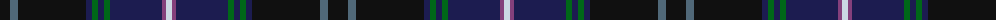

The parent of this is [Dugan (Personal)](/tartans/k/20/na8/k68/db6/g6/db6/g6/db52/n4/ln/6/)

This was sourced from tartans-authority.  It is a [10 stripes tartan](/stripes/stripes10/).

Original link http://www.tartansauthority.com/tartan-ferret/display/7483/

## Thread count
K/20 Na8 K68 DB6 G6 DB6 G6 DB52 N4 LN/6

## Palette
Each colour and its ΔE from the base-6 reference it is a variant of.

| Colour | Shade | Base | ΔE (OKLab) |
|---|---|---|---|
| DB |  `#1C1C50` | B  | 0.14 |
| G |  `#006818` | G  | 0.02 |
| K |  `#101010` | K  | 0.17 |
| LN |  `#CCD8E4` | W  | 0.09 |
| N |  `#84407C` | B  | 0.15 |
| Na |  `#506878` | B  | 0.14 |

ID: /variants/k/20/na8/k68/db6/g6/db6/g6/db52/n4/ln/6-db1c1c50-g006818-k101010-lnccd8e4-n84407c-na506878/
