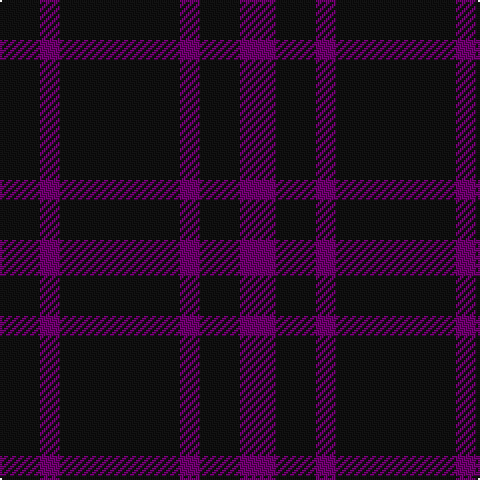

The parent of this is [Leonard Hunting](/tartans/k/20/p10/k60/p10/k20/p/18/)

This was sourced from register-of-tartans.  It is a [6 stripes tartan](/stripes/stripes6/).

Original link https://www.tartanregister.gov.uk/tartanDetails.aspx?ref=2099

## Thread count
K/20 P10 K60 P10 K20 P/18

## Palette
Each colour and its ΔE from the base-6 reference it is a variant of.

| Colour | Shade | Base | ΔE (OKLab) |
|---|---|---|---|
| K |  `#101010` | K  | 0.17 |
| P |  `#6C006C` | B  | 0.15 |

# Sample pattern

ID: /variants/k/20/p10/k60/p10/k20/p/18-k101010-p6c006c/
