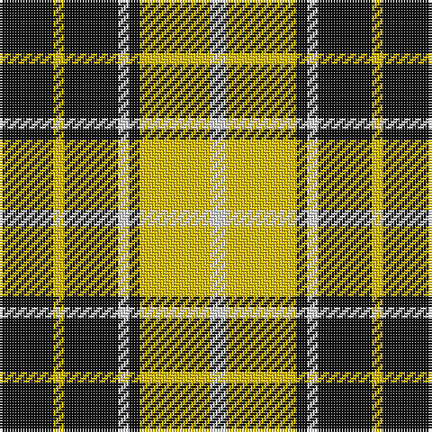

The parent of this is [Nooten-Boom (Personal)](/tartans/k/20/y4/k20/ln4/k4/y26/ln/6/)

This was sourced from tartans-authority.  It is a [7 stripes tartan](/stripes/stripes7/).

Original link http://www.tartansauthority.com/tartan-ferret/display/4021/

## Thread count
K/20 Y4 K20 LN4 K4 Y26 LN/6

## Palette
Each colour and its ΔE from the base-6 reference it is a variant of.

| Colour | Shade | Base | ΔE (OKLab) |
|---|---|---|---|
| K |  `#101010` | K  | 0.17 |
| LN |  `#E0E0E0` | W  | 0.06 |
| Y |  `#E8C000` | Y  | 0.00 |

# Sample pattern

ID: /variants/k/20/y4/k20/ln4/k4/y26/ln/6-k101010-lne0e0e0-ye8c000/
