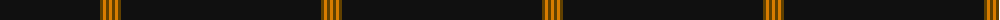

The parent of this is [SmartWool (Corporate)](/tartans/k/200/t3/o3/t3/o/3/)

This was sourced from tartans-authority.  It is a [5 stripes tartan](/stripes/stripes5/).

Original link http://www.tartansauthority.com/tartan-ferret/display/5828/

## Thread count
K/200 T3 O3 T3 O/3

## Palette
Each colour and its ΔE from the base-6 reference it is a variant of.

| Colour | Shade | Base | ΔE (OKLab) |
|---|---|---|---|
| K |  `#101010` | K  | 0.17 |
| O |  `#D87C00` | Y  | 0.17 |
| T |  `#604000` | G  | 0.14 |

# Sample pattern

ID: /variants/k/200/t3/o3/t3/o/3-k101010-od87c00-t604000/
