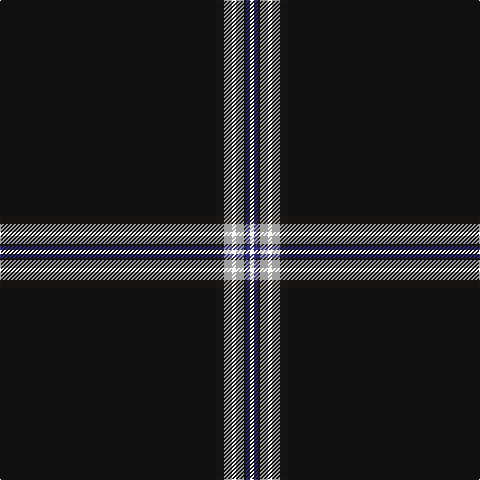

The parent of this is [Modern Craft (Masonic)](/tartans/k/216/ka8/n8/w4/n8/ka2/db4/w/4/)

This was sourced from register-of-tartans.  It is a [8 stripes tartan](/stripes/stripes8/).

Original link https://www.tartanregister.gov.uk/tartanDetails.aspx?ref=11044

## Thread count
K/216 Ka8 N8 W4 N8 Ka2 DB4 W/4

## Palette
Each colour and its ΔE from the base-6 reference it is a variant of.

| Colour | Shade | Base | ΔE (OKLab) |
|---|---|---|---|
| DB |  `#2C2C80` | B  | 0.05 |
| K |  `#101010` | K  | 0.17 |
| Ka |  `#1C1714` | K  | 0.21 |
| N |  `#A0A0A0` | Y  | 0.20 |
| Na |  `#5C5C5C` | B  | 0.14 |
| W |  `#FCFCFC` | W  | 0.03 |

# Sample pattern

ID: /variants/k/216/ka8/n8/w4/n8/ka2/db4/w/4-db2c2c80-k101010-ka1c1714-na0a0a0-na5c5c5c-wfcfcfc/
