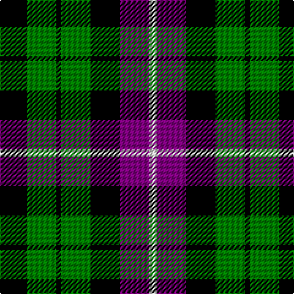

The parent of this is [Wilson's, No 97](/tartans/k/22/g24/k4/g24/k24/p24/ln/6/)

This was sourced from weddslist.  It is a [7 stripes tartan](/stripes/stripes7/).

Original link http://www.weddslist.com/cgi-bin/tartans/pg.pl?source=sts

## Thread count
K/22 G24 K4 G24 K24 P24 LN/6

## Palette
Each colour and its ΔE from the base-6 reference it is a variant of.

| Colour | Shade | Base | ΔE (OKLab) |
|---|---|---|---|
| G |  `#008000` | G  | 0.09 |
| K |  `#000000` | K  | 0.00 |
| LN |  `#E0E0E0` | W  | 0.06 |
| P |  `#800080` | B  | 0.17 |

# Sample pattern

ID: /variants/k/22/g24/k4/g24/k24/p24/ln/6-g008000-k000000-lne0e0e0-p800080/
