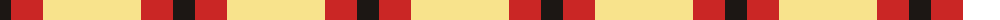

The parent of this is [Quenouille (2011)](/tartans/k/22/r32/ly/98/)

This was sourced from register-of-tartans.  It is a [3 stripes tartan](/stripes/stripes3/).

Original link https://www.tartanregister.gov.uk/tartanDetails.aspx?ref=10479

## Thread count
K/22 R32 LY/98

## Palette
Each colour and its ΔE from the base-6 reference it is a variant of.

| Colour | Shade | Base | ΔE (OKLab) |
|---|---|---|---|
| K |  `#1C1714` | K  | 0.21 |
| LY |  `#F8E38C` | Y  | 0.11 |
| R |  `#CA2625` | R  | 0.03 |

# Sample pattern

ID: /variants/k/22/r32/ly/98-k1c1714-lyf8e38c-rca2625/
