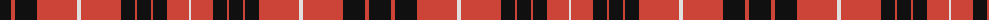

The parent of this is [Westwood MacBrick (Fashion)](/tartans/k/22/r4/k22/r40/ln4/r40/k14/r2/k14/r2/k14/r22/ln/2/)

This was sourced from tartans-authority.  It is a [13 stripes tartan](/stripes/stripes13/).

Original link http://www.tartansauthority.com/tartan-ferret/display/7485/

## Thread count
K/22 R4 K22 R40 LN4 R40 K14 R2 K14 R2 K14 R22 LN/2

## Palette
Each colour and its ΔE from the base-6 reference it is a variant of.

| Colour | Shade | Base | ΔE (OKLab) |
|---|---|---|---|
| K |  `#101010` | K  | 0.17 |
| LN |  `#E0E0E0` | W  | 0.06 |
| R |  `#CC4438` | R  | 0.07 |

ID: /variants/k/22/r4/k22/r40/ln4/r40/k14/r2/k14/r2/k14/r22/ln/2-k101010-lne0e0e0-rcc4438/
