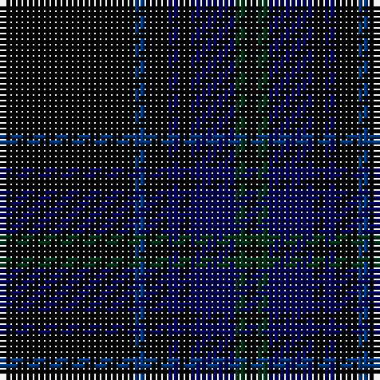

The parent of this is [Scottish Funereal Association (Corp)](/tartans/k/24/db2/k4/dba2/k2/dba8/dg2/k/2/)

This was sourced from tartans-authority.  It is a [8 stripes tartan](/stripes/stripes8/).

Original link http://www.tartansauthority.com/tartan-ferret/display/5357/

## Thread count
K/24 DB2 K4 DBa2 K2 DBa8 DG2 K/2

## Palette
Each colour and its ΔE from the base-6 reference it is a variant of.

| Colour | Shade | Base | ΔE (OKLab) |
|---|---|---|---|
| DB |  `#003478` | B  | 0.06 |
| DBa |  `#000050` | B  | 0.20 |
| DG |  `#003014` | G  | 0.18 |
| K |  `#000000` | K  | 0.00 |

# Sample pattern

ID: /variants/k/24/db2/k4/dba2/k2/dba8/dg2/k/2-db003478-dba000050-dg003014-k000000/
