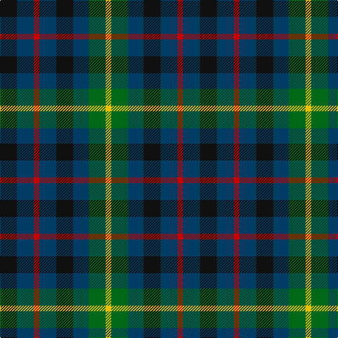

The parent of this is [Montrose of Alabama (District)](/tartans/k/24/db24/r8/db24/k24/db22/g24/y/8/)

This was sourced from tartans-authority.  It is a [8 stripes tartan](/stripes/stripes8/).

Original link http://www.tartansauthority.com/tartan-ferret/display/2288/

## Thread count
K/24 DB24 R8 DB24 K24 DB22 G24 Y/8

## Palette
Each colour and its ΔE from the base-6 reference it is a variant of.

| Colour | Shade | Base | ΔE (OKLab) |
|---|---|---|---|
| DB |  `#003C64` | B  | 0.07 |
| G |  `#006818` | G  | 0.02 |
| K |  `#101010` | K  | 0.17 |
| R |  `#C80000` | R  | 0.00 |
| Y |  `#E8C000` | Y  | 0.00 |

# Sample pattern

ID: /variants/k/24/db24/r8/db24/k24/db22/g24/y/8-db003c64-g006818-k101010-rc80000-ye8c000/
