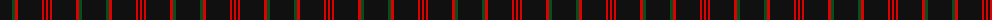

The parent of this is [Unidentified #45](/tartans/k/24/g3/r3/k24/r2/k2/r/2/)

This was sourced from register-of-tartans.  It is a [7 stripes tartan](/stripes/stripes7/).

Original link https://www.tartanregister.gov.uk/tartanDetails.aspx?ref=4246

## Thread count
K/24 G3 R3 K24 R2 K2 R/2

## Palette
Each colour and its ΔE from the base-6 reference it is a variant of.

| Colour | Shade | Base | ΔE (OKLab) |
|---|---|---|---|
| G |  `#005020` | G  | 0.08 |
| K |  `#101010` | K  | 0.17 |
| R |  `#DC0000` | R  | 0.04 |

# Sample pattern

ID: /variants/k/24/g3/r3/k24/r2/k2/r/2-g005020-k101010-rdc0000/
