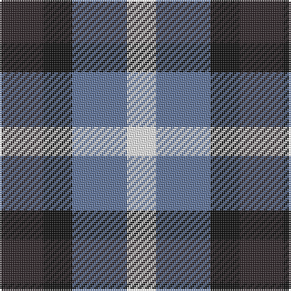

The parent of this is [Equity Vision Ltd](/tartans/k/24/ka16/b30/w/16/)

This was sourced from register-of-tartans.  It is a [4 stripes tartan](/stripes/stripes4/).

Original link https://www.tartanregister.gov.uk/tartanDetails.aspx?ref=11397

## Thread count
K/24 Ka16 B30 W/16

## Palette
Each colour and its ΔE from the base-6 reference it is a variant of.

| Colour | Shade | Base | ΔE (OKLab) |
|---|---|---|---|
| B |  `#5F749C` | B  | 0.17 |
| K |  `#2E2528` | B  | 0.17 |
| Ka |  `#101010` | K  | 0.17 |
| W |  `#FFFFFF` | W  | 0.03 |

# Sample pattern

ID: /variants/k/24/ka16/b30/w/16-b5f749c-k2e2528-ka101010-wffffff/
