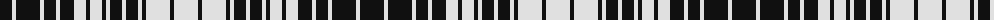

The parent of this is [Ogilvy B/W Trade Tartan Tartan Number: 1250. Earliest known date: pre 2003 Full sett can be seen in STS files. See products available Copyright © Blair Urquhart, Comrie, 2015](/tartans/k/24/ln4/k24/ln4/k12/ln4/k14/ln12/k4/ln12/k4/ln4/k12/ln4/k12/ln4/k4/ln24/k4/ln/24/)

This was sourced from house-of-tartan.  It is a [20 stripes tartan](/stripes/stripes20/).

Original link http://www.house-of-tartan.scotland.net/house/TartanViewjs.asp?colr=Def&tnam=1250

## Thread count
K/24 LN4 K24 LN4 K12 LN4 K14 LN12 K4 LN12 K4 LN4 K12 LN4 K12 LN4 K4 LN24 K4 LN/24

## Palette
Each colour and its ΔE from the base-6 reference it is a variant of.

| Colour | Shade | Base | ΔE (OKLab) |
|---|---|---|---|
| K |  `#101010` | K  | 0.17 |
| LN |  `#E0E0E0` | W  | 0.06 |

ID: /variants/k/24/ln4/k24/ln4/k12/ln4/k14/ln12/k4/ln12/k4/ln4/k12/ln4/k12/ln4/k4/ln24/k4/ln/24-k101010-lne0e0e0/
