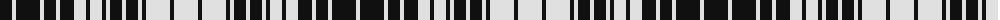

The parent of this is [Ogilvie (Black and White)](/tartans/k/24/ln4/k24/ln4/k12/ln4/k14/ln12/k4/ln12/k4/ln4/k12/ln4/k12/ln4/k4/ln24/k4/ln24/k4/ln24/k4/ln4/k12/ln4/k12/ln4/k4/ln12/k4/ln12/k14/ln4/k12/ln4/k24/ln/4/)

This was sourced from register-of-tartans.  It is a [38 stripes tartan](/stripes/stripes38/).

Original link https://www.tartanregister.gov.uk/tartanDetails.aspx?ref=3225

## Thread count
K/24 LN4 K24 LN4 K12 LN4 K14 LN12 K4 LN12 K4 LN4 K12 LN4 K12 LN4 K4 LN24 K4 LN24 K4 LN24 K4 LN4 K12 LN4 K12 LN4 K4 LN12 K4 LN12 K14 LN4 K12 LN4 K24 LN/4

## Palette
Each colour and its ΔE from the base-6 reference it is a variant of.

| Colour | Shade | Base | ΔE (OKLab) |
|---|---|---|---|
| K |  `#101010` | K  | 0.17 |
| LN |  `#E0E0E0` | W  | 0.06 |

ID: /variants/k/24/ln4/k24/ln4/k12/ln4/k14/ln12/k4/ln12/k4/ln4/k12/ln4/k12/ln4/k4/ln24/k4/ln24/k4/ln24/k4/ln4/k12/ln4/k12/ln4/k4/ln12/k4/ln12/k14/ln4/k12/ln4/k24/ln/4-k101010-lne0e0e0/
