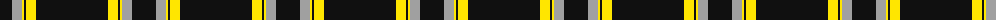
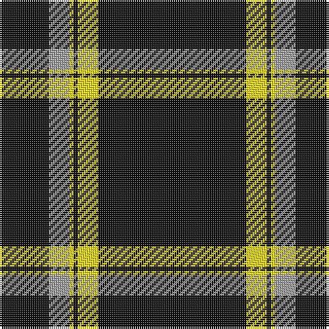

The parent of this is [Merola (2016)](/tartans/k/24/n10/y2/k2/y10/k/72/)

This was sourced from register-of-tartans.  It is a [6 stripes tartan](/stripes/stripes6/).

Original link https://www.tartanregister.gov.uk/tartanDetails.aspx?ref=11543

## Thread count
K/24 N10 Y2 K2 Y10 K/72

## Palette
Each colour and its ΔE from the base-6 reference it is a variant of.

| Colour | Shade | Base | ΔE (OKLab) |
|---|---|---|---|
| K |  `#101010` | K  | 0.17 |
| N |  `#A0A0A0` | Y  | 0.20 |
| Y |  `#FFE600` | Y  | 0.10 |

# Sample pattern

ID: /variants/k/24/n10/y2/k2/y10/k/72-k101010-na0a0a0-yffe600/
