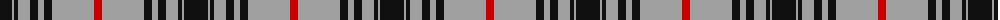

The parent of this is [MacKnight (Name)](/tartans/k/24/n2/k4/n12/k8/n6/k8/n42/r/8/)

This was sourced from tartans-authority.  It is a [9 stripes tartan](/stripes/stripes9/).

Original link http://www.tartansauthority.com/tartan-ferret/display/7794/

## Thread count
K/24 N2 K4 N12 K8 N6 K8 N42 R/8

## Palette
Each colour and its ΔE from the base-6 reference it is a variant of.

| Colour | Shade | Base | ΔE (OKLab) |
|---|---|---|---|
| K |  `#101010` | K  | 0.17 |
| N |  `#A0A0A0` | Y  | 0.20 |
| R |  `#C80000` | R  | 0.00 |

ID: /variants/k/24/n2/k4/n12/k8/n6/k8/n42/r/8-k101010-na0a0a0-rc80000/
