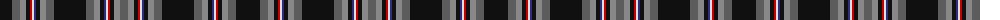

The parent of this is [Iron Horse (Corporate)](/tartans/k/24/n8/na6/k4/r2/ln2/db2/k4/na6/n8/k32/n8/na6/k4/db2/ln2/r2/k4/na6/n/8/)

This was sourced from tartans-authority.  It is a [20 stripes tartan](/stripes/stripes20/).

Original link http://www.tartansauthority.com/tartan-ferret/display/3820/

## Thread count
K/24 N8 Na6 K4 R2 LN2 DB2 K4 Na6 N8 K32 N8 Na6 K4 DB2 LN2 R2 K4 Na6 N/8

## Palette
Each colour and its ΔE from the base-6 reference it is a variant of.

| Colour | Shade | Base | ΔE (OKLab) |
|---|---|---|---|
| DB |  `#2C2C80` | B  | 0.05 |
| K |  `#101010` | K  | 0.17 |
| LN |  `#E0E0E0` | W  | 0.06 |
| N |  `#5C5C5C` | B  | 0.14 |
| Na |  `#888888` | R  | 0.24 |
| R |  `#C80000` | R  | 0.00 |

ID: /variants/k/24/n8/na6/k4/r2/ln2/db2/k4/na6/n8/k32/n8/na6/k4/db2/ln2/r2/k4/na6/n/8-db2c2c80-k101010-lne0e0e0-n5c5c5c-na888888-rc80000/
