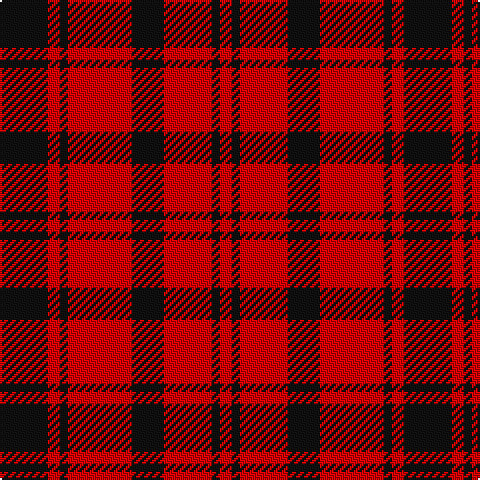

The parent of this is [MacLeod #2](/tartans/k/24/r6/k4/r32/k16/r24/k4/r/6/)

This was sourced from register-of-tartans.  It is a [8 stripes tartan](/stripes/stripes8/).

Original link https://www.tartanregister.gov.uk/tartanDetails.aspx?ref=2627

## Thread count
K/24 R6 K4 R32 K16 R24 K4 R/6

## Palette
Each colour and its ΔE from the base-6 reference it is a variant of.

| Colour | Shade | Base | ΔE (OKLab) |
|---|---|---|---|
| K |  `#101010` | K  | 0.17 |
| R |  `#DC0000` | R  | 0.04 |

# Sample pattern

ID: /variants/k/24/r6/k4/r32/k16/r24/k4/r/6-k101010-rdc0000/
