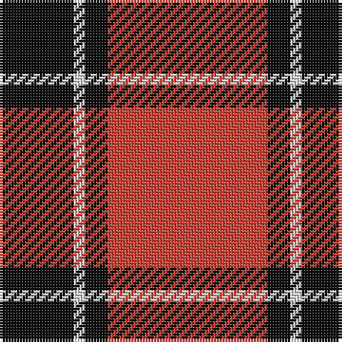

The parent of this is [Dunbar (District)](/tartans/k/26/ln4/k8/r/56/)

This was sourced from tartans-authority.  It is a [4 stripes tartan](/stripes/stripes4/).

Original link http://www.tartansauthority.com/tartan-ferret/display/1236/

## Thread count
K/26 LN4 K8 R/56

## Palette
Each colour and its ΔE from the base-6 reference it is a variant of.

| Colour | Shade | Base | ΔE (OKLab) |
|---|---|---|---|
| K |  `#101010` | K  | 0.17 |
| LN |  `#E0E0E0` | W  | 0.06 |
| R |  `#CC4438` | R  | 0.07 |

# Sample pattern

ID: /variants/k/26/ln4/k8/r/56-k101010-lne0e0e0-rcc4438/
