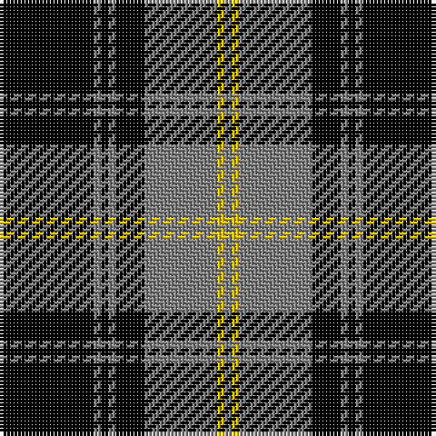

The parent of this is [West Point](/tartans/k/26/n2/k2/n2/k8/n20/y2/n/2/)

This was sourced from weddslist.  It is a [8 stripes tartan](/stripes/stripes8/).

Original link http://www.weddslist.com/cgi-bin/tartans/pg.pl?source=sts

## Thread count
K/26 N2 K2 N2 K8 N20 Y2 N/2

## Palette
Each colour and its ΔE from the base-6 reference it is a variant of.

| Colour | Shade | Base | ΔE (OKLab) |
|---|---|---|---|
| K |  `#000000` | K  | 0.00 |
| N |  `#808080` | G  | 0.22 |
| Y |  `#F0C000` | Y  | 0.01 |

# Sample pattern

ID: /variants/k/26/n2/k2/n2/k8/n20/y2/n/2-k000000-n808080-yf0c000/
