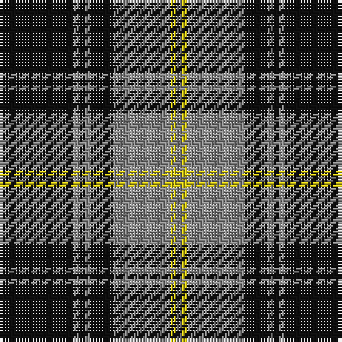

The parent of this is [West Point](/tartans/k/26/n2/k2/n2/k8/n20/y2/n/2/)

This was sourced from register-of-tartans.  It is a [8 stripes tartan](/stripes/stripes8/).

Original link https://www.tartanregister.gov.uk/tartanDetails.aspx?ref=4604

## Thread count
K/26 N2 K2 N2 K8 N20 Y2 N/2

## Palette
Each colour and its ΔE from the base-6 reference it is a variant of.

| Colour | Shade | Base | ΔE (OKLab) |
|---|---|---|---|
| K |  `#101010` | K  | 0.17 |
| N |  `#888888` | R  | 0.24 |
| Y |  `#CCC018` | Y  | 0.04 |

# Sample pattern

ID: /variants/k/26/n2/k2/n2/k8/n20/y2/n/2-k101010-n888888-yccc018/
