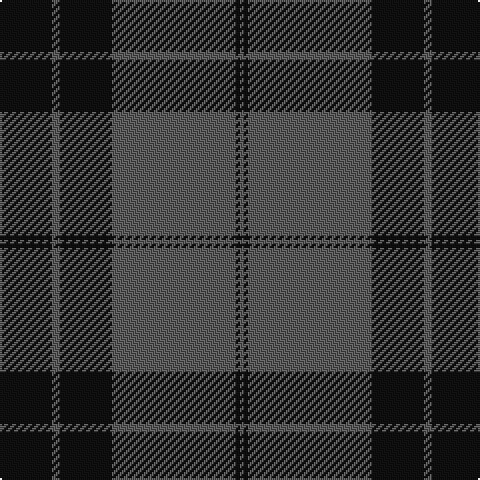

The parent of this is [Silver Mist (Corporate)](/tartans/k/26/n4/k26/n62/k2/n/2/)

This was sourced from tartans-authority.  It is a [6 stripes tartan](/stripes/stripes6/).

Original link http://www.tartansauthority.com/tartan-ferret/display/6927/

## Thread count
K/26 N4 K26 N62 K2 N/2

## Palette
Each colour and its ΔE from the base-6 reference it is a variant of.

| Colour | Shade | Base | ΔE (OKLab) |
|---|---|---|---|
| K |  `#101010` | K  | 0.17 |
| N |  `#5C5C5C` | B  | 0.14 |

# Sample pattern

ID: /variants/k/26/n4/k26/n62/k2/n/2-k101010-n5c5c5c/
