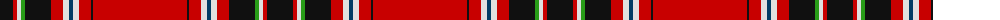

The parent of this is [Trevison Personal Tartan Tartan Number: 5846. Earliest known date: 18.06.03 Final version. Includes the colours of the Italian flag. See products available Copyright © Blair Urquhart, Comrie, 2015](/tartans/k/26/r4/ln4/g4/k26/r12/ln6/db4/ln6/r12/k2/r/94/)

This was sourced from house-of-tartan.  It is a [12 stripes tartan](/stripes/stripes12/).

Original link http://www.house-of-tartan.scotland.net/house/TartanViewjs.asp?colr=Def&tnam=5846

## Thread count
K/26 R4 LN4 G4 K26 R12 LN6 DB4 LN6 R12 K2 R/94

## Palette
Each colour and its ΔE from the base-6 reference it is a variant of.

| Colour | Shade | Base | ΔE (OKLab) |
|---|---|---|---|
| DB |  `#003C64` | B  | 0.07 |
| G |  `#289C18` | G  | 0.18 |
| K |  `#101010` | K  | 0.17 |
| LN |  `#E0E0E0` | W  | 0.06 |
| R |  `#C80000` | R  | 0.00 |

ID: /variants/k/26/r4/ln4/g4/k26/r12/ln6/db4/ln6/r12/k2/r/94-db003c64-g289c18-k101010-lne0e0e0-rc80000/
