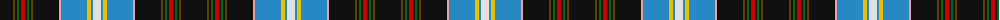

The parent of this is [Kungsholmen Snooker](/tartans/k/26/t2/k2/g2/k2/r4/k2/g2/k2/t2/k26/lr2/ba26/y4/ba2/ln/8/)

This was sourced from register-of-tartans.  It is a [16 stripes tartan](/stripes/stripes16/).

Original link https://www.tartanregister.gov.uk/tartanDetails.aspx?ref=2017

## Thread count
K/26 T2 K2 G2 K2 R4 K2 G2 K2 T2 K26 LR2 Ba26 Y4 Ba2 LN/8

## Palette
Each colour and its ΔE from the base-6 reference it is a variant of.

| Colour | Shade | Base | ΔE (OKLab) |
|---|---|---|---|
| B |  `#1474B4` | B  | 0.15 |
| Ba |  `#2888C4` | B  | 0.21 |
| DB |  `#2C2C80` | B  | 0.05 |
| G |  `#006818` | G  | 0.02 |
| K |  `#101010` | K  | 0.17 |
| LN |  `#E0E0E0` | W  | 0.06 |
| LR |  `#ECA0A0` | Y  | 0.17 |
| R |  `#C80000` | R  | 0.00 |
| T |  `#604000` | G  | 0.14 |
| Y |  `#E8C000` | Y  | 0.00 |

ID: /variants/k/26/t2/k2/g2/k2/r4/k2/g2/k2/t2/k26/lr2/ba26/y4/ba2/ln/8-b1474b4-ba2888c4-db2c2c80-g006818-k101010-lne0e0e0-lreca0a0-rc80000-t604000-ye8c000/
