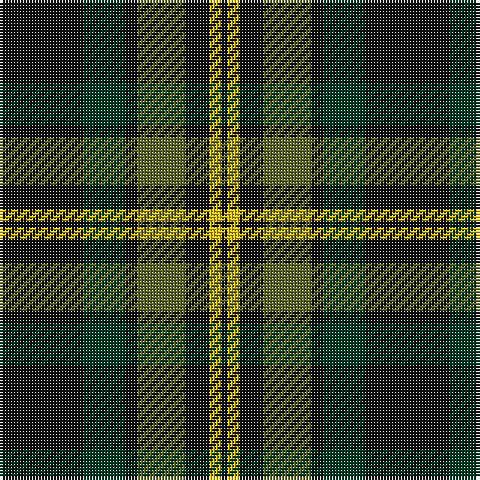

The parent of this is [Grass of Rasunda (Commemorative)](/tartans/k/28/dg14/k4/g16/k8/y4/k/2/)

This was sourced from tartans-authority.  It is a [7 stripes tartan](/stripes/stripes7/).

Original link http://www.tartansauthority.com/tartan-ferret/display/10346/

## Thread count
K/28 DG14 K4 G16 K8 Y4 K/2

## Palette
Each colour and its ΔE from the base-6 reference it is a variant of.

| Colour | Shade | Base | ΔE (OKLab) |
|---|---|---|---|
| DG |  `#003820` | G  | 0.16 |
| G |  `#5C6428` | G  | 0.09 |
| K |  `#101010` | K  | 0.17 |
| Y |  `#E8C000` | Y  | 0.00 |

# Sample pattern

ID: /variants/k/28/dg14/k4/g16/k8/y4/k/2-dg003820-g5c6428-k101010-ye8c000/
