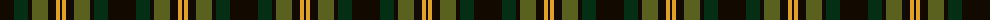
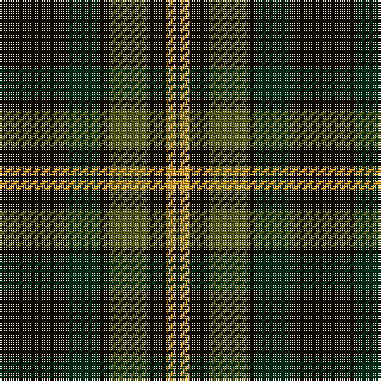

The parent of this is [Grass of Rasunda (2009), The](/tartans/k/28/dg14/k4/g16/k8/y4/k/2/)

This was sourced from register-of-tartans.  It is a [7 stripes tartan](/stripes/stripes7/).

Original link https://www.tartanregister.gov.uk/tartanDetails.aspx?ref=10346

## Thread count
K/28 DG14 K4 G16 K8 Y4 K/2

## Palette
Each colour and its ΔE from the base-6 reference it is a variant of.

| Colour | Shade | Base | ΔE (OKLab) |
|---|---|---|---|
| DG |  `#052F14` | G  | 0.19 |
| G |  `#5A601E` | G  | 0.09 |
| K |  `#120A01` | K  | 0.15 |
| Y |  `#E0A126` | Y  | 0.08 |

# Sample pattern

ID: /variants/k/28/dg14/k4/g16/k8/y4/k/2-dg052f14-g5a601e-k120a01-ye0a126/
