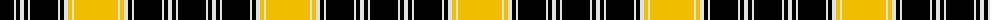

The parent of this is [Thain, dress](/tartans/k/28/ln2/k4/ln4/k4/ln2/k28/ln2/k4/ln4/y4/ln2/y/44/)

This was sourced from weddslist.  It is a [13 stripes tartan](/stripes/stripes13/).

Original link http://www.weddslist.com/cgi-bin/tartans/pg.pl?source=sts

## Thread count
K/28 LN2 K4 LN4 K4 LN2 K28 LN2 K4 LN4 Y4 LN2 Y/44

## Palette
Each colour and its ΔE from the base-6 reference it is a variant of.

| Colour | Shade | Base | ΔE (OKLab) |
|---|---|---|---|
| K |  `#000000` | K  | 0.00 |
| LN |  `#E0E0E0` | W  | 0.06 |
| Y |  `#F0C000` | Y  | 0.01 |

ID: /variants/k/28/ln2/k4/ln4/k4/ln2/k28/ln2/k4/ln4/y4/ln2/y/44-k000000-lne0e0e0-yf0c000/
