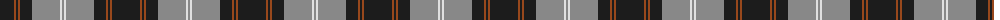
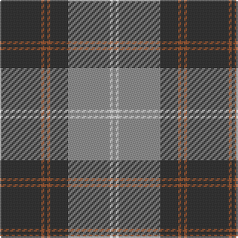

The parent of this is [Corrie (Fashion)](/tartans/k/28/t2/k2/t2/k12/n28/ln2/n/2/)

This was sourced from tartans-authority.  It is a [8 stripes tartan](/stripes/stripes8/).

Original link http://www.tartansauthority.com/tartan-ferret/display/6875/

## Thread count
K/28 T2 K2 T2 K12 N28 LN2 N/2

## Palette
Each colour and its ΔE from the base-6 reference it is a variant of.

| Colour | Shade | Base | ΔE (OKLab) |
|---|---|---|---|
| K |  `#1C1C1C` | B  | 0.20 |
| LN |  `#E0E0E0` | W  | 0.06 |
| N |  `#888888` | R  | 0.24 |
| T |  `#98481C` | R  | 0.11 |

# Sample pattern

ID: /variants/k/28/t2/k2/t2/k12/n28/ln2/n/2-k1c1c1c-lne0e0e0-n888888-t98481c/
