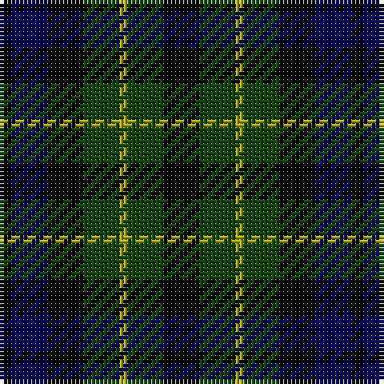

The parent of this is [Campbell of Breadalbane](/tartans/k/3/db9/k9/dg9/lg2/dg9/k/9/)

This was sourced from weddslist.  It is a [7 stripes tartan](/stripes/stripes7/).

Original link http://www.weddslist.com/cgi-bin/tartans/pg.pl?source=x

## Thread count
K/3 DB9 K9 DG9 LG2 DG9 K/9

## Palette
Each colour and its ΔE from the base-6 reference it is a variant of.

| Colour | Shade | Base | ΔE (OKLab) |
|---|---|---|---|
| DB |  `#000052` | B  | 0.20 |
| DG |  `#11450D` | G  | 0.10 |
| K |  `#000000` | K  | 0.00 |
| LG |  `#AAAA00` | Y  | 0.11 |

# Sample pattern

ID: /variants/k/3/db9/k9/dg9/lg2/dg9/k/9-db000052-dg11450d-k000000-lgaaaa00/
