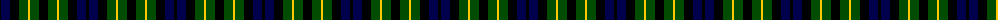
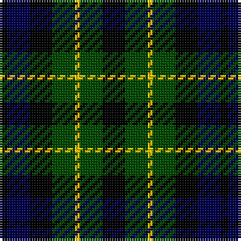

The parent of this is [Campbell Breadalbane](/tartans/k/3/db9/k9/g9/y2/g9/k/9/)

This was sourced from weddslist.  It is a [7 stripes tartan](/stripes/stripes7/).

Original link http://www.weddslist.com/cgi-bin/tartans/pg.pl?source=rb

## Thread count
K/3 DB9 K9 G9 Y2 G9 K/9

## Palette
Each colour and its ΔE from the base-6 reference it is a variant of.

| Colour | Shade | Base | ΔE (OKLab) |
|---|---|---|---|
| DB |  `#00004C` | B  | 0.21 |
| G |  `#004C00` | G  | 0.08 |
| K |  `#000000` | K  | 0.00 |
| Y |  `#FFC800` | Y  | 0.04 |

# Sample pattern

ID: /variants/k/3/db9/k9/g9/y2/g9/k/9-db00004c-g004c00-k000000-yffc800/
