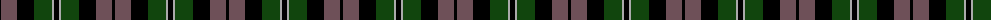

The parent of this is [Melville](/tartans/k/3/n16/k17/dg18/na2/k/5/)

This was sourced from weddslist.  It is a [6 stripes tartan](/stripes/stripes6/).

Original link http://www.weddslist.com/cgi-bin/tartans/pg.pl?source=x

## Thread count
K/3 N16 K17 DG18 Na2 K/5

## Palette
Each colour and its ΔE from the base-6 reference it is a variant of.

| Colour | Shade | Base | ΔE (OKLab) |
|---|---|---|---|
| DG |  `#11450D` | G  | 0.10 |
| K |  `#000000` | K  | 0.00 |
| N |  `#6E5058` | B  | 0.14 |
| Na |  `#AAAAAA` | Y  | 0.19 |

# Sample pattern

ID: /variants/k/3/n16/k17/dg18/na2/k/5-dg11450d-k000000-n6e5058-naaaaaaa/
