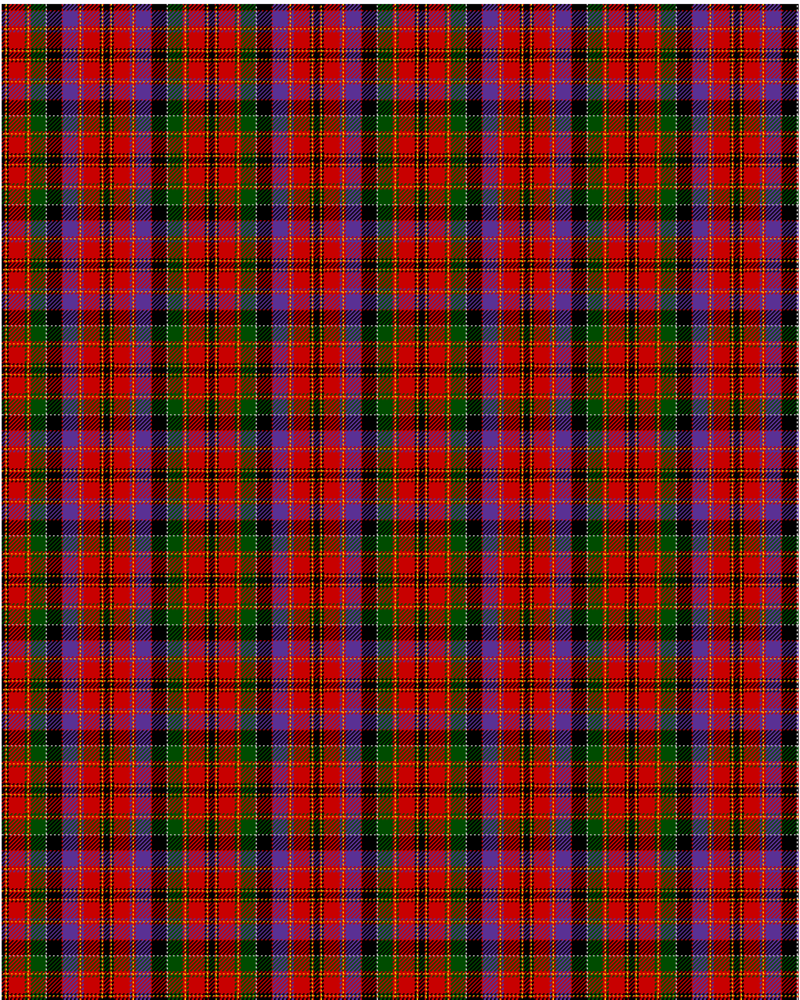

Hay and Leith

This was sourced from <no value>.  It is a 23 stripes tartan.

Original link http://www.weddslist.com/cgi-bin/tartans/pg.pl?source=rb

## Thread count
K/3 R1 Y1 K2 R16 G2 R1 Y1 R2 G15 N1 K15 R1 P15 R2 Y1 R1 P2 R16 K2 Y1 R1 K/3

## Palette
G#004C00 K#000000 N#D0D0D0 P#5A3094 R#C80000 Y#FFC800

# Sample pattern

ID: /variants/k/3/r1/y1/k2/r16/g2/r1/y1/r2/g15/n1/k15/r1/p15/r2/y1/r1/p2/r16/k2/y1/r1/k/3-g004c00-k000000-nd0d0d0-p5a3094-rc80000-yffc800