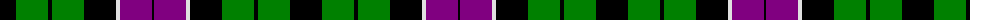

The parent of this is [Unnamed No 33](/tartans/k/32/g32/k4/g32/k32/ln4/p32/k/2/)

This was sourced from weddslist.  It is a [8 stripes tartan](/stripes/stripes8/).

Original link http://www.weddslist.com/cgi-bin/tartans/pg.pl?source=sts

## Thread count
K/32 G32 K4 G32 K32 LN4 P32 K/2

## Palette
Each colour and its ΔE from the base-6 reference it is a variant of.

| Colour | Shade | Base | ΔE (OKLab) |
|---|---|---|---|
| G |  `#008000` | G  | 0.09 |
| K |  `#000000` | K  | 0.00 |
| LN |  `#E0E0E0` | W  | 0.06 |
| P |  `#800080` | B  | 0.17 |

# Sample pattern

ID: /variants/k/32/g32/k4/g32/k32/ln4/p32/k/2-g008000-k000000-lne0e0e0-p800080/
