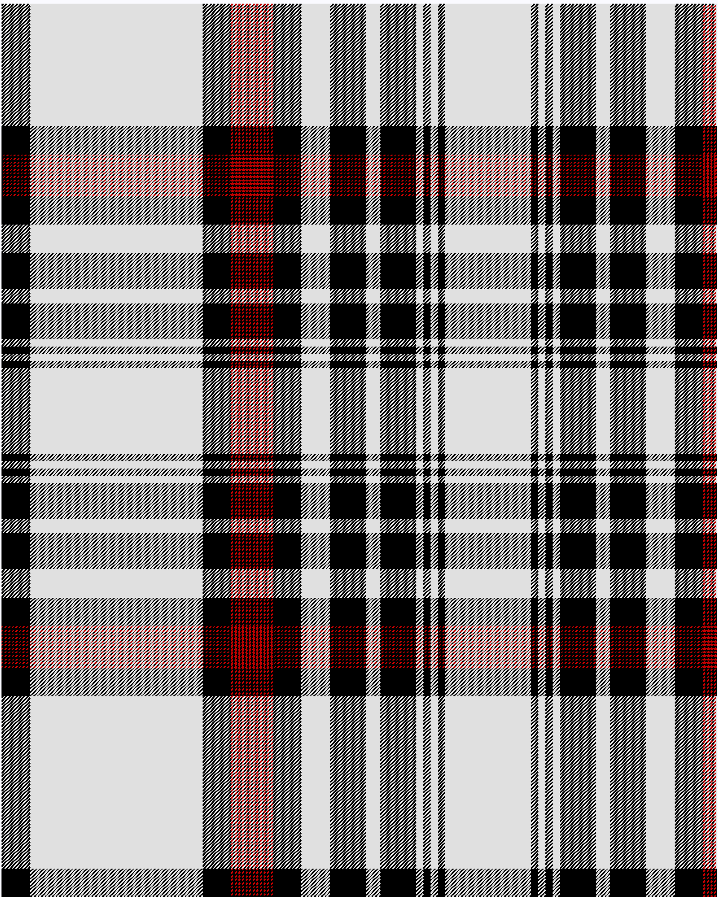

Dunbar, Plaid

This was sourced from <no value>.  It is a 36 stripes tartan.

Original link http://www.weddslist.com/cgi-bin/tartans/pg.pl?source=sts

## Thread count
K/32 LN192 K32 R2 K2 R2 K2 R2 K2 R2 K2 R2 K2 R2 K2 R2 K2 R2 K2 R2 K2 R2 K2 R2 K2 R2 K32 LN32 K40 LN16 K40 LN8 K8 LN8 K8 LN/48

## Palette
K#000000 LN#E0E0E0 R#C00000

# Sample pattern

ID: /variants/k/32/ln192/k32/r2/k2/r2/k2/r2/k2/r2/k2/r2/k2/r2/k2/r2/k2/r2/k2/r2/k2/r2/k2/r2/k2/r2/k32/ln32/k40/ln16/k40/ln8/k8/ln8/k8/ln/48-k000000-lne0e0e0-rc00000