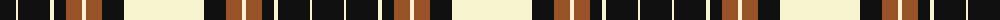

The parent of this is [Lebrun (Fashion)](/tartans/k/32/ly2/k32/ly4/k12/t16/ly4/t16/k22/ly/80/)

This was sourced from tartans-authority.  It is a [10 stripes tartan](/stripes/stripes10/).

Original link http://www.tartansauthority.com/tartan-ferret/display/5404/

## Thread count
K/32 LY2 K32 LY4 K12 T16 LY4 T16 K22 LY/80

## Palette
Each colour and its ΔE from the base-6 reference it is a variant of.

| Colour | Shade | Base | ΔE (OKLab) |
|---|---|---|---|
| K |  `#101010` | K  | 0.17 |
| LY |  `#F8F4D0` | W  | 0.04 |
| T |  `#985428` | R  | 0.12 |

ID: /variants/k/32/ly2/k32/ly4/k12/t16/ly4/t16/k22/ly/80-k101010-lyf8f4d0-t985428/
