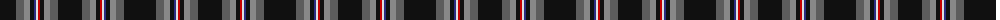

The parent of this is [Iron Horse Clan Tartan Tartan Number: 3820. Earliest known date: 2002 Designed for members of the Iron Horse 'Clan' (used in the loose sense) a group of American motorcycle enthusiasts wishing to express their identity and heritage through their own tartan. Only for members of the Iron Horse group and their families. See products available Copyright © Blair Urquhart, Comrie, 2015](/tartans/k/32/n8/na6/k4/db2/ln2/r2/k4/na6/n8/k/24/)

This was sourced from house-of-tartan.  It is a [11 stripes tartan](/stripes/stripes11/).

Original link http://www.house-of-tartan.scotland.net/house/TartanViewjs.asp?colr=Def&tnam=3820

## Thread count
K/32 N8 Na6 K4 DB2 LN2 R2 K4 Na6 N8 K/24

## Palette
Each colour and its ΔE from the base-6 reference it is a variant of.

| Colour | Shade | Base | ΔE (OKLab) |
|---|---|---|---|
| DB |  `#2C2C80` | B  | 0.05 |
| K |  `#101010` | K  | 0.17 |
| LN |  `#E0E0E0` | W  | 0.06 |
| N |  `#5C5C5C` | B  | 0.14 |
| Na |  `#888888` | R  | 0.24 |
| R |  `#C80000` | R  | 0.00 |

ID: /variants/k/32/n8/na6/k4/db2/ln2/r2/k4/na6/n8/k/24-db2c2c80-k101010-lne0e0e0-n5c5c5c-na888888-rc80000/
