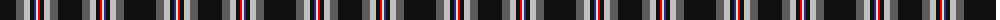

The parent of this is [Iron Horse](/tartans/k/32/n8/na6/k4/db2/ln2/r2/k4/na6/n8/k/24/)

This was sourced from register-of-tartans.  It is a [11 stripes tartan](/stripes/stripes11/).

Original link https://www.tartanregister.gov.uk/tartanDetails.aspx?ref=5088

## Thread count
K/32 N8 Na6 K4 DB2 LN2 R2 K4 Na6 N8 K/24

## Palette
Each colour and its ΔE from the base-6 reference it is a variant of.

| Colour | Shade | Base | ΔE (OKLab) |
|---|---|---|---|
| DB |  `#2C2C80` | B  | 0.05 |
| K |  `#101010` | K  | 0.17 |
| LN |  `#E0E0E0` | W  | 0.06 |
| N |  `#5C5C5C` | B  | 0.14 |
| Na |  `#C0C0C0` | W  | 0.16 |
| R |  `#FF0000` | R  | 0.11 |

ID: /variants/k/32/n8/na6/k4/db2/ln2/r2/k4/na6/n8/k/24-db2c2c80-k101010-lne0e0e0-n5c5c5c-nac0c0c0-rff0000/
