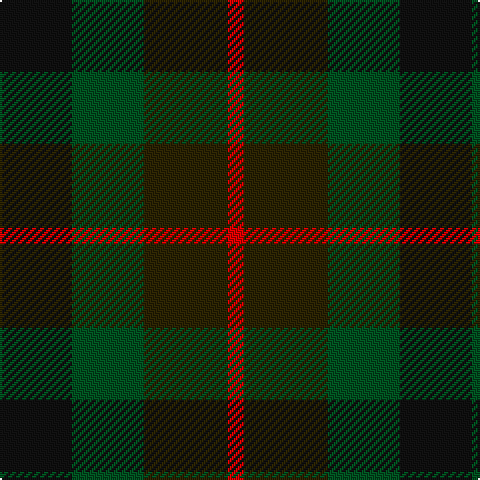

The parent of this is [Tennant](/tartans/k/36/g36/ka42/r/8/)

This was sourced from register-of-tartans.  It is a [4 stripes tartan](/stripes/stripes4/).

Original link https://www.tartanregister.gov.uk/tartanDetails.aspx?ref=4088

## Thread count
K/36 G36 Ka42 R/8

## Palette
Each colour and its ΔE from the base-6 reference it is a variant of.

| Colour | Shade | Base | ΔE (OKLab) |
|---|---|---|---|
| G |  `#005020` | G  | 0.08 |
| K |  `#101010` | K  | 0.17 |
| Ka |  `#2A2303` | B  | 0.21 |
| R |  `#DC0000` | R  | 0.04 |

# Sample pattern

ID: /variants/k/36/g36/ka42/r/8-g005020-k101010-ka2a2303-rdc0000/
