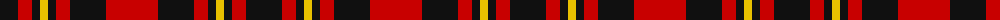

The parent of this is [Haig & Haig Whisky](/tartans/k/36/r14/k8/y8/k8/r14/k36/r/52/)

This was sourced from register-of-tartans.  It is a [8 stripes tartan](/stripes/stripes8/).

Original link https://www.tartanregister.gov.uk/tartanDetails.aspx?ref=1568

## Thread count
K/36 R14 K8 Y8 K8 R14 K36 R/52

## Palette
Each colour and its ΔE from the base-6 reference it is a variant of.

| Colour | Shade | Base | ΔE (OKLab) |
|---|---|---|---|
| DR |  `#880000` | R  | 0.14 |
| DY |  `#D09800` | Y  | 0.11 |
| K |  `#101010` | K  | 0.17 |
| R |  `#C80000` | R  | 0.00 |
| Y |  `#E8C000` | Y  | 0.00 |

# Sample pattern

ID: /variants/k/36/r14/k8/y8/k8/r14/k36/r/52-dr880000-dyd09800-k101010-rc80000-ye8c000/
