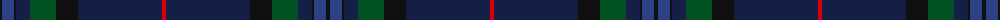

The parent of this is [Scottish Heritage](/tartans/k/4/b12/k2/db14/g26/k22/db84/r/4/)

This was sourced from register-of-tartans.  It is a [8 stripes tartan](/stripes/stripes8/).

Original link https://www.tartanregister.gov.uk/tartanDetails.aspx?ref=5103

## Thread count
K/4 B12 K2 DB14 G26 K22 DB84 R/4

## Palette
Each colour and its ΔE from the base-6 reference it is a variant of.

| Colour | Shade | Base | ΔE (OKLab) |
|---|---|---|---|
| B |  `#2C4084` | B  | 0.00 |
| DB |  `#141E46` | B  | 0.15 |
| G |  `#005020` | G  | 0.08 |
| K |  `#101010` | K  | 0.17 |
| R |  `#DC0000` | R  | 0.04 |

# Sample pattern

ID: /variants/k/4/b12/k2/db14/g26/k22/db84/r/4-b2c4084-db141e46-g005020-k101010-rdc0000/
