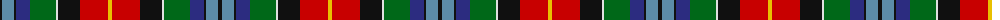

The parent of this is [Teall of Teallach Family Tartan Tartan Number: 1065. Earliest known date: 1966 Adopted by the Scottish Tartans Society in recognition of many years service of their chairman, Dr Gordon Teall. See products available Copyright © Blair Urquhart, Comrie, 2015](/tartans/k/4/b12/k2/db14/g26/ln2/k22/r28/y/4/)

This was sourced from house-of-tartan.  It is a [9 stripes tartan](/stripes/stripes9/).

Original link http://www.house-of-tartan.scotland.net/house/TartanViewjs.asp?colr=Def&tnam=1065

## Thread count
K/4 B12 K2 DB14 G26 LN2 K22 R28 Y/4

## Palette
Each colour and its ΔE from the base-6 reference it is a variant of.

| Colour | Shade | Base | ΔE (OKLab) |
|---|---|---|---|
| B |  `#5C8CA8` | B  | 0.23 |
| DB |  `#2C2C80` | B  | 0.05 |
| G |  `#006818` | G  | 0.02 |
| K |  `#101010` | K  | 0.17 |
| LN |  `#E0E0E0` | W  | 0.06 |
| R |  `#C80000` | R  | 0.00 |
| Y |  `#E8C000` | Y  | 0.00 |

ID: /variants/k/4/b12/k2/db14/g26/ln2/k22/r28/y/4-b5c8ca8-db2c2c80-g006818-k101010-lne0e0e0-rc80000-ye8c000/
