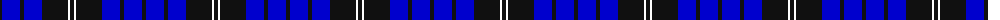
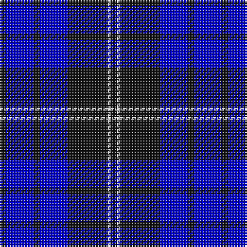

The parent of this is [Swan 2015, Brian E (Personal)](/tartans/k/4/b18/k4/b18/k26/w2/k/4/)

This was sourced from register-of-tartans.  It is a [7 stripes tartan](/stripes/stripes7/).

Original link https://www.tartanregister.gov.uk/tartanDetails.aspx?ref=11382

## Thread count
K/4 B18 K4 B18 K26 W2 K/4

## Palette
Each colour and its ΔE from the base-6 reference it is a variant of.

| Colour | Shade | Base | ΔE (OKLab) |
|---|---|---|---|
| B |  `#0000CD` | B  | 0.15 |
| K |  `#101010` | K  | 0.17 |
| W |  `#FFFFFF` | W  | 0.03 |

# Sample pattern

ID: /variants/k/4/b18/k4/b18/k26/w2/k/4-b0000cd-k101010-wffffff/
