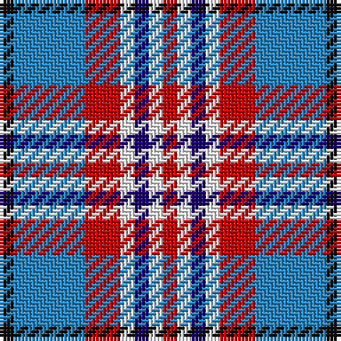

The parent of this is [U.S. Postal Service (Corporate)](/tartans/k/4/b20/r10/w4/db4/w4/r/4/)

This was sourced from tartans-authority.  It is a [7 stripes tartan](/stripes/stripes7/).

Original link http://www.tartansauthority.com/tartan-ferret/display/4166/

## Thread count
K/4 B20 R10 W4 DB4 W4 R/4

## Palette
Each colour and its ΔE from the base-6 reference it is a variant of.

| Colour | Shade | Base | ΔE (OKLab) |
|---|---|---|---|
| B |  `#2888C4` | B  | 0.21 |
| DB |  `#1C0070` | B  | 0.14 |
| K |  `#101010` | K  | 0.17 |
| R |  `#C80000` | R  | 0.00 |
| W |  `#FCFCFC` | W  | 0.03 |

# Sample pattern

ID: /variants/k/4/b20/r10/w4/db4/w4/r/4-b2888c4-db1c0070-k101010-rc80000-wfcfcfc/
