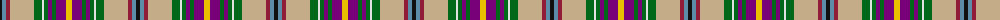

The parent of this is [Oregon, State of (US State)](/tartans/k/4/b4/dr4/lg24/g8/ln2/g4/p4/g4/p10/y/6/)

This was sourced from tartans-authority.  It is a [11 stripes tartan](/stripes/stripes11/).

Original link http://www.tartansauthority.com/tartan-ferret/display/5743/

## Thread count
K/4 B4 DR4 LG24 G8 LN2 G4 P4 G4 P10 Y/6

## Palette
Each colour and its ΔE from the base-6 reference it is a variant of.

| Colour | Shade | Base | ΔE (OKLab) |
|---|---|---|---|
| B |  `#5C8CA8` | B  | 0.23 |
| DR |  `#901C38` | R  | 0.12 |
| G |  `#006818` | G  | 0.02 |
| K |  `#101010` | K  | 0.17 |
| LG |  `#C4AC88` | Y  | 0.13 |
| LN |  `#E0E0E0` | W  | 0.06 |
| P |  `#780078` | B  | 0.16 |
| Y |  `#E8C000` | Y  | 0.00 |

ID: /variants/k/4/b4/dr4/lg24/g8/ln2/g4/p4/g4/p10/y/6-b5c8ca8-dr901c38-g006818-k101010-lgc4ac88-lne0e0e0-p780078-ye8c000/
