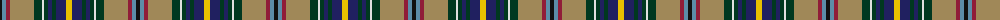

The parent of this is [Oregon American District Tartan Tartan Number: 5743. Earliest known date: 2002 The State of Oregon tartan was adopted at the 72nd Oregon Legislative Assembly by Senate Joint Resolution 31 in a letter from State Governor Theodore R Kulongoski dated April 12th 2003. Blue is from the Oregon flag and its rivers and ocean. Gold from the flag and represents agriculture. White for the snow-capped mountains. Taupe (light brown) is for the high desert and grasslands. Azure for the streams, and the skies. Black, the obsidian buttes. See products available Copyright © Blair Urquhart, Comrie, 2015](/tartans/k/4/b4/dr4/lt24/dg8/ln2/dg4/db4/dg4/db10/y/6/)

This was sourced from house-of-tartan.  It is a [11 stripes tartan](/stripes/stripes11/).

Original link http://www.house-of-tartan.scotland.net/house/TartanViewjs.asp?colr=Def&tnam=5743

## Thread count
K/4 B4 DR4 LT24 DG8 LN2 DG4 DB4 DG4 DB10 Y/6

## Palette
Each colour and its ΔE from the base-6 reference it is a variant of.

| Colour | Shade | Base | ΔE (OKLab) |
|---|---|---|---|
| B |  `#5C8CA8` | B  | 0.23 |
| DB |  `#202060` | B  | 0.11 |
| DG |  `#003820` | G  | 0.16 |
| DR |  `#901C38` | R  | 0.12 |
| K |  `#101010` | K  | 0.17 |
| LN |  `#E0E0E0` | W  | 0.06 |
| LT |  `#A08858` | Y  | 0.21 |
| Y |  `#E8C000` | Y  | 0.00 |

ID: /variants/k/4/b4/dr4/lt24/dg8/ln2/dg4/db4/dg4/db10/y/6-b5c8ca8-db202060-dg003820-dr901c38-k101010-lne0e0e0-lta08858-ye8c000/
