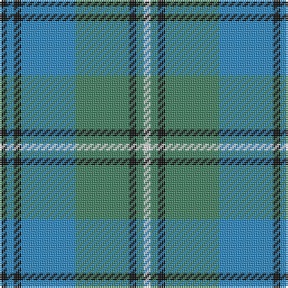

The parent of this is [Ben Lomond (Fashion)](/tartans/k/4/b4/k4/b30/g30/k4/g4/ln/4/)

This was sourced from tartans-authority.  It is a [8 stripes tartan](/stripes/stripes8/).

Original link http://www.tartansauthority.com/tartan-ferret/display/6500/

## Thread count
K/4 B4 K4 B30 G30 K4 G4 LN/4

## Palette
Each colour and its ΔE from the base-6 reference it is a variant of.

| Colour | Shade | Base | ΔE (OKLab) |
|---|---|---|---|
| B |  `#2888C4` | B  | 0.21 |
| G |  `#408060` | G  | 0.13 |
| K |  `#101010` | K  | 0.17 |
| LN |  `#E0E0E0` | W  | 0.06 |

# Sample pattern

ID: /variants/k/4/b4/k4/b30/g30/k4/g4/ln/4-b2888c4-g408060-k101010-lne0e0e0/
