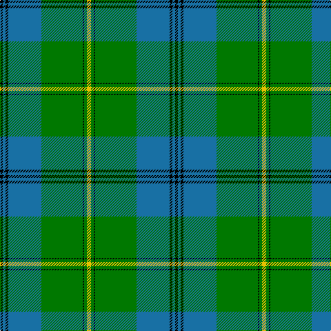

The parent of this is [Johnston (Clan)](/tartans/k/4/b4/k4/b48/g60/k2/g4/y/6/)

This was sourced from tartans-authority.  It is a [8 stripes tartan](/stripes/stripes8/).

Original link http://www.tartansauthority.com/tartan-ferret/display/1063/

## Thread count
K/4 B4 K4 B48 G60 K2 G4 Y/6

## Palette
Each colour and its ΔE from the base-6 reference it is a variant of.

| Colour | Shade | Base | ΔE (OKLab) |
|---|---|---|---|
| B |  `#1870A4` | B  | 0.14 |
| G |  `#007800` | G  | 0.06 |
| K |  `#000000` | K  | 0.00 |
| Y |  `#E8C000` | Y  | 0.00 |

# Sample pattern

ID: /variants/k/4/b4/k4/b48/g60/k2/g4/y/6-b1870a4-g007800-k000000-ye8c000/
