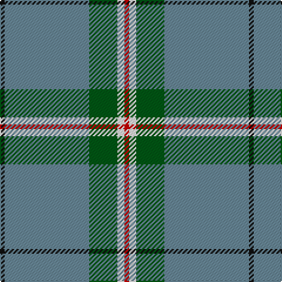

The parent of this is [Cleland (Name)](/tartans/k/4/b72/g24/w6/r/4/)

This was sourced from tartans-authority.  It is a [5 stripes tartan](/stripes/stripes5/).

Original link http://www.tartansauthority.com/tartan-ferret/display/2181/

## Thread count
K/4 B72 G24 W6 R/4

## Palette
Each colour and its ΔE from the base-6 reference it is a variant of.

| Colour | Shade | Base | ΔE (OKLab) |
|---|---|---|---|
| B |  `#688898` | G  | 0.23 |
| G |  `#005814` | G  | 0.04 |
| K |  `#101010` | K  | 0.17 |
| R |  `#C80000` | R  | 0.00 |
| W |  `#F8F8F8` | W  | 0.01 |

# Sample pattern

ID: /variants/k/4/b72/g24/w6/r/4-b688898-g005814-k101010-rc80000-wf8f8f8/
