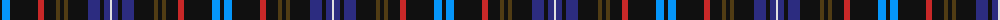

The parent of this is [Kennedy (Irish)](/tartans/k/4/b8/k28/r6/k12/t4/k4/t4/k20/db12/k4/db6/ln/2/)

This was sourced from register-of-tartans.  It is a [13 stripes tartan](/stripes/stripes13/).

Original link https://www.tartanregister.gov.uk/tartanDetails.aspx?ref=1945

## Thread count
K/4 B8 K28 R6 K12 T4 K4 T4 K20 DB12 K4 DB6 LN/2

## Palette
Each colour and its ΔE from the base-6 reference it is a variant of.

| Colour | Shade | Base | ΔE (OKLab) |
|---|---|---|---|
| B |  `#0596FA` | B  | 0.28 |
| DB |  `#2C2C80` | B  | 0.05 |
| K |  `#101010` | K  | 0.17 |
| LN |  `#E0E0E0` | W  | 0.06 |
| R |  `#C82828` | R  | 0.03 |
| T |  `#503C14` | G  | 0.15 |

ID: /variants/k/4/b8/k28/r6/k12/t4/k4/t4/k20/db12/k4/db6/ln/2-b0596fa-db2c2c80-k101010-lne0e0e0-rc82828-t503c14/
