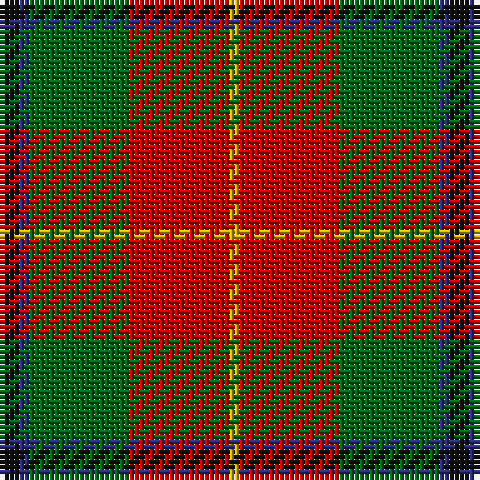

The parent of this is [Turnbull Dress (Clan)](/tartans/k/4/db2/g20/r20/y/2/)

This was sourced from tartans-authority.  It is a [5 stripes tartan](/stripes/stripes5/).

Original link http://www.tartansauthority.com/tartan-ferret/display/1035/

## Thread count
K/4 DB2 G20 R20 Y/2

## Palette
Each colour and its ΔE from the base-6 reference it is a variant of.

| Colour | Shade | Base | ΔE (OKLab) |
|---|---|---|---|
| DB |  `#2C2C80` | B  | 0.05 |
| G |  `#006818` | G  | 0.02 |
| K |  `#101010` | K  | 0.17 |
| R |  `#C80000` | R  | 0.00 |
| Y |  `#D8B000` | Y  | 0.05 |

# Sample pattern

ID: /variants/k/4/db2/g20/r20/y/2-db2c2c80-g006818-k101010-rc80000-yd8b000/
